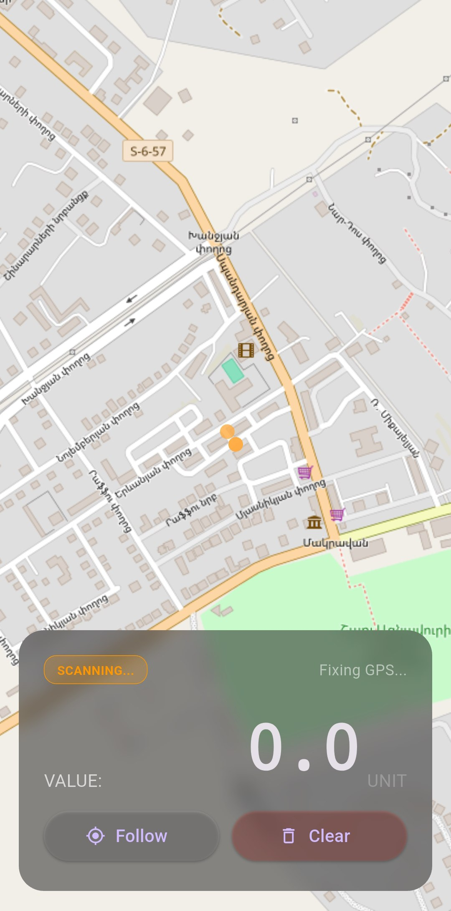

# GeigerConnect ☢️

**GeigerConnect** is an open-source project dedicated to creating an affordable, portable dosimeter that turns your smartphone into a powerful radiation mapping tool.

### 📖 About the Project
The idea behind **GeigerConnect** was born from a simple observation: professional Bluetooth-enabled dosimeters are either overpriced or rely on closed-source, proprietary apps. I wanted to create a "people's tool" — an accessible, open-source device that allows anyone to visualize the invisible.

Currently, the project is in its exciting "first steps" phase. I have developed a functional mobile app that communicates with a microcontroller via Bluetooth and maps data points in real-time. While the physical Geiger counter hardware is still on the workbench, the digital core is ready and tested using data simulation. My goal is to design a complete, easy-to-build kit with a custom PCB and a 3D-printed case that anyone can replicate at home.

---

### ✨ Key Features
*   **Live Mapping:** Build radiation tracks with real-time markers based on OpenStreetMap (OSM).
*   **BLE Connectivity:** Energy-efficient connection using Bluetooth Low Energy.
*   **Cross-platform:** Mobile app built with Flutter (supports both Android and iOS).
*   **DIY Friendly:** Designed to be assembled from widely available off-the-shelf components.

### 🛠 Technical Stack
*   **App:** Flutter (Mobile Framework)
*   **Maps:** OpenStreetMap (OSM)
*   **Microcontroller:** ESP32
*   **Communication:** BLE (Bluetooth Low Energy)
*   **Planned Hardware:** Geiger-Müller tube (SBM-20 / J305), OLED display, custom PCB.

---

### 📅 Roadmap
- [x] **Phase 1: Connectivity & Logic**
  - [x] BLE communication protocol (ESP32 <-> App)
  - [x] Live map integration (OSM) and marker logic
- [ ] **Phase 2: Hardware Design (In Progress)**
  - [ ] Schematic design (Geiger tube driver + High-voltage module)
  - [ ] Custom PCB layout and prototyping
  - [ ] 3D-printable enclosure design
- [ ] **Phase 3: Final Integration**
  - [ ] Standalone OLED display support
  - [ ] Field testing and calibration
  - [ ] Data export features (CSV/KML)

### 📂 Repository Structure
*   `/app` — Mobile application source code (Flutter).
*   `/firmware` — ESP32 microcontroller code.
*   `/hardware` — (Work in progress) Schematics, Gerber files, and 3D models.

---

### 💡 How to Contribute
This project is fully open for suggestions! If you have ideas for improving the app or the electronics, feel free to open an **Issue** or submit a **Pull Request**. Let's make radiation safety accessible to everyone!

